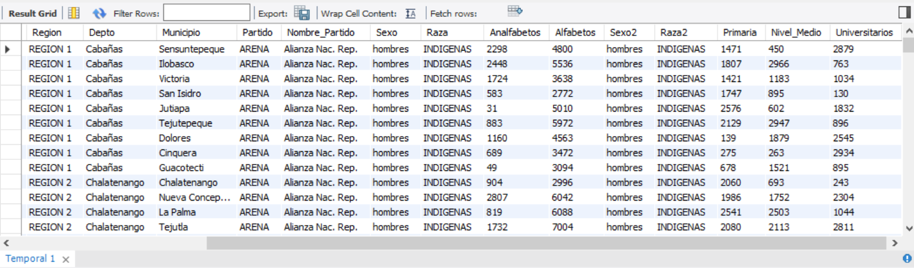
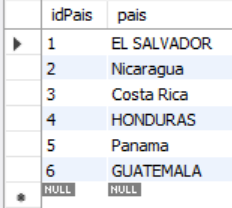
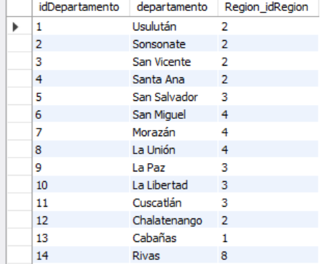
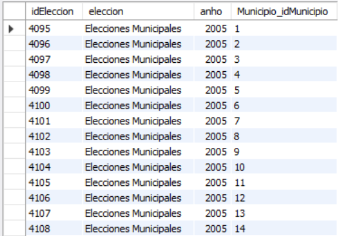
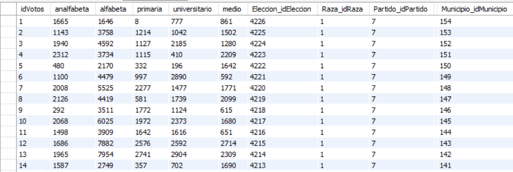
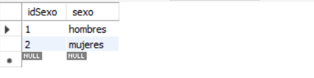
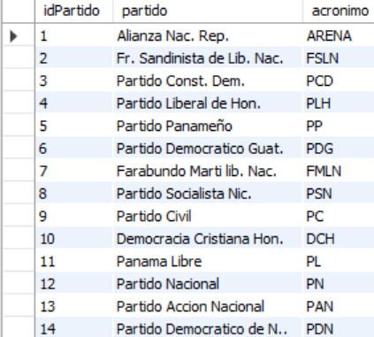
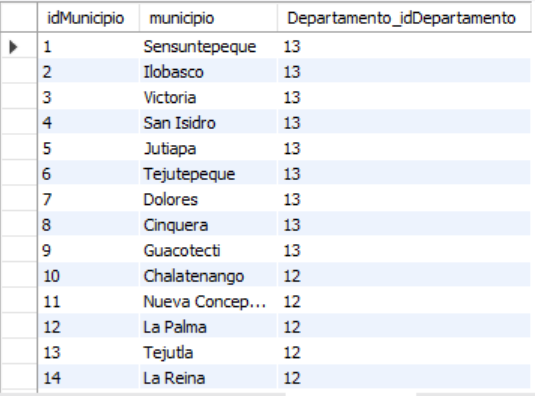
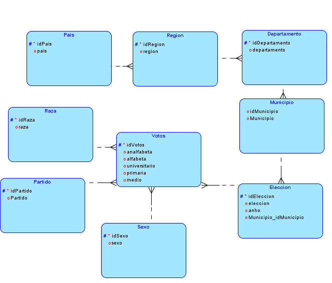
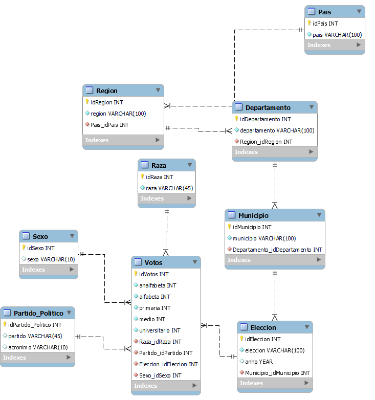

# BD1-Proyecto2-201404405

**UNIVERSIDAD DE SAN CARLOS DE GUATEMALA** 
**FACULTAD DE INGENIERÍA** 
**ESCUELA DE INGENIERÍA EN CIENCIAS Y SISTEMAS** 
**SISTEMAS DE BASES DE DATOS 1** 
**SECCIÓN B** 

 
 

 
  

| Nombre                             | Carné     |
|------------------------------------|-----------|
| Juan Antonio Pineda Espino              | 201404405 |

# Normalizacion

 **Datos de Entrada**

 
  

# Primera Forma Normal
La primera forma normal describe que todos los atributos llave están definidos. No hay grupos repetidos en la tabla. En otras palabras, cada intersección de renglón/columna contiene un solo valor, no un conjunto de ellos.

Observando los datos de entrada se pueden encontrar una variedad de datos repetidos, sexo, raza, pais, departamento, etc. Tambien Se debe tomar en cuenta que existen dos columnas repetidas (sexo y raza) por lo cual, estas se obvian totalmente al aplicar la primera forma normal y asi evitando grupos repetidos.

Al aplicar dicha eliminacion de grupos repetidos, se obtuvieron las siguientes tablas:
 
 
## 
Pais

  

 
 

## 
Departamento

  

 
 

## 
Eleccion

  

 
 

## 
Votos

  

 
 

## 
Sexo

  

 
 

## 
Partido_Politico

  

 
 

## 
Municipio

  

 
 

# Segunda Forma Normal
Una relación está en 2FN si está en 1FN y si los atributos que no forman parte de ninguna clave dependen de forma completa de la clave principal. Es decir que no existen dependencias parciales. (Todos los atributos que no son clave principal deben depender únicamente de la clave principal).

Luego de haber aplicado la primera forma normal, se busca una forma de relacionar las entidades nuevas creadas y hacer que estas dependan unicamente de una clave principal. Aplicando la 2FN se puede relacionar las tablas Region con Pais, Elecciones con Municipio, Votos con Raza, sexo, Elecciones, Partido_Politico, etc. A continuación se muestran la relacion entre las tablas:

## 
Region y Pais

| idRegion                          |   Region  | Pais_idPais |
|------------------------------------|-----------| ------- |
| 1              | REGION 1 | 1 |
| 2              | REGION 2 | 2 |
| 3              | REGION 2 | 1 |
| 4              | REGION 3 | 4 |

Como se puede observar la Tabla Region depende de una principal, y se relaciona con un pais unico, cumpliendo asi una dependencia total entre una tabla y otra.
 
 

## 
Region y Departamento

| idDepartamento                          |   Departamento  | Region_idRegion |
|------------------------------------|-----------| ------- |
| 1              | Zacapa | 1 |
| 2              | Jalapa | 2 |
| 3              | Usulutan | 1 |
| 4              | Morazán | 4 |

De la misma forma que la tabla **Region** con **Pais** existe tambien una dependencia total entre Departamento y Region, cumpliendo asi con la 2FN.
 
 

Y asi mismo se busco un id unico para cada tabla y asi poder romper con las dependencias parciales y permitir que cada tabla dependa unicamente de su clave principal escogida.

# Tercera Forma Normal
Una entidad cumple la tercera forma normal si cada atributo de clave no primaria proporciona un hecho independiente de otros atributos no de clave y que depende únicamente de la clave

Para la aplicacion de la 3FN se puede tomar como ejemplo la tabla Votos, que desde los datos de entrada, se normalizo para poder tener una sola entidad donde se tenga la cantidad de votos entre analfabetas, alfabetas, personas con educacion primaria, media y universitarios. Tomando en cuenta que para que esta tabla funcione correctamente es indispensable tener una clave foranea de Partido_Politico, Sexo, Raza, Eleccion para poder evitar cualquier tipo de incoveniente a la hora de actualizar alguno de estos 'campos' en una futura eleccion. Por ejemplo si se añade un Partido Politico nuevo, se podra tener actualizado los votos independientemente del año en que estos se realicen.

## 
Votos

  

 
 

# Modelo Logico

  

 
 

# Modelo Relacional

  

 
 

# Lista de Entidades
- Pais
- Region
- Departamento
- Municipio
- Eleccion
- Raza
- Sexo
- Partido_Politico
- Votos

# Listado de Atributos
### Pais
| No |   Nombre  | Tipo | Primary | Forean | Unique | Not Null
|----|-----------| ------- | ---- | ------ | ------ | -------
| 1  | idPais | Integer | &check; |  | &check; | &check;
| 2  | Pais | Varchar(50) | |  | &check; | &check;

### Region
| No |   Nombre  | Tipo | Primary | Forean | Unique | Not Null
|----|-----------| ------- | ---- | ------ | ------ | -------
| 1  | idRegion | Integer | &check; |  | &check; | &check;
| 2  | Region | Varchar(50) |  |  |  | &check;
| 3 | Pais_idPais | Integer |  |  &check;  |  | &check;

### Departamento
| No |   Nombre  | Tipo | Primary | Forean | Unique | Not Null
|----|-----------| ------- | ---- | ------ | ------ | -------
| 1  | idDepartamento | Integer | &check; |  | &check; | &check;
| 2  | departamento | Varchar(50) |  |  | | &check;
| 3  | Region_idregion | Integer |  | &check; | | &check;

### Municipio
| No |   Nombre  | Tipo | Primary | Forean | Unique | Not Null
|----|-----------| ------- | ---- | ------ | ------ | -------
| 1  | idMunicipio | Integer | &check; |  | &check; | &check;
| 2  | municipio | Varchar(50) |  |  |  | &check;
| 3  | Departamento_idDepartamento | Integer |  |  &check;  |  | &check;

### Eleccion
| No |   Nombre  | Tipo | Primary | Forean | Unique | Not Null
|----|-----------| ------- | ---- | ------ | ------ | -------
| 1  | idEleccion | Integer | &check; |  | &check; | &check;
| 2  | eleccion | Varchar(100) |  |  |  | &check;
| 3  | eleccion | Year |  |  |  | &check;
| 4  | Municipio_idMunicipio | Integer |  |  &check;  |  | &check;

### Raza
| No |   Nombre  | Tipo | Primary | Forean | Unique | Not Null
|----|-----------| ------- | ---- | ------ | ------ | -------
| 1  | idRaza | Integer | &check; |  | &check; | &check;
| 2  | raza | Varchar(50) | |  | &check; | &check;

### Sexo
| No |   Nombre  | Tipo | Primary | Forean | Unique | Not Null
|----|-----------| ------- | ---- | ------ | ------ | -------
| 1  | idSexo | Integer | &check; |  | &check; | &check;
| 2  | sexo | Varchar(50) | |  | &check; | &check;

### Partido_Politico
| No |   Nombre  | Tipo | Primary | Forean | Unique | Not Null
|----|-----------| ------- | ---- | ------ | ------ | -------
| 1  | idPartido | Integer | &check; |  | &check; | &check;
| 2  | partido | Varchar(150) | |  | &check; | &check;
| 3  | acronimo | Varchar(10) | |  | &check; | &check;

### Votos
| No |   Nombre  | Tipo | Primary | Forean | Unique | Not Null
|----|-----------| ------- | ---- | ------ | ------ | -------
| 1  | idVotos | Integer | &check; |  | &check; | &check;
| 2  | analfabeta | Integer |  |  |  | &check;
| 3  | alfabeta | Integer |  |  |  | &check;
| 4  | primaria | Integer |  |  |  | &check;
| 5  | medio | Integer |  |  |  | &check;
| 6  | universitario | Integer |  |  |  | &check;
| 7  | Raza_idRaza | Integer |  | &check; |  | &check;
| 8  | Sexo_idSexo | Integer |  | &check; |  | &check;
| 9  | Eleccion_idEleccion | Integer |  |  &check;  |  | &check;
| 10  | Partido_idPartido | Integer |  |  &check; |  | &check;

# Relaciones entre Entidades
 - Pais puede tener uno o mas Region
 - Region puede tener uno o mas Departamento, puede tener un unico Pais
 - Departamento tiene uno o mas Municipio, tiene una unica Region
 - Municipio tiene una o mas Eleccion, tiene un unico Departamento
 - Eleccion tiene uno o mas resultados de Votos, tiene un unico Municipio
 - Raza tiene uno o mas resultados de Votos
 - Sexo tiene uno o mas resultados de Votos
 - Partido_Politico tiene uno o mas resultados de Votos
 - Los resultados de Votos tiene una unica Raza, un unico Sexo, pertenecen a un Partido_Politico y a una unica Eleccion

# Consideracion de Diseño
- Se elimino las columnas repetidas de raza y sexo para evitar datos innecesarios
- Se creo la entidad Raza y Sexo para deshacerse de los datos repetidos. Esto tambien se realizo para una entidad Pais, Municipio, Departamento, Partido
- Existia una relacion de muchos a muchos la cual resulto en una tabla intermediaria llamada Votos. Esta tabla tiene los resultados de los distintos tipos de elecciones, entre los distintos años, distintas razas, etc.

